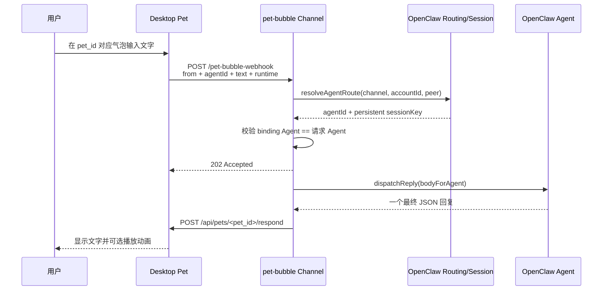

# Desktop Pet × OpenClaw 架构

## 1. 架构目标

OpenClaw 集成遵循“OpenClaw 负责大脑、Desktop Pet 负责身体”的边界：

- OpenClaw 管理 Agent、模型、性格、身份、会话上下文和长期记忆；
- Desktop Pet 管理宠物实例、UI、动画、聊天气泡、配置和本地 API；
- 每只独立 AI 桌宠拥有唯一的 Agent 绑定和独立 direct session；
- 正常聊天只使用一条 Channel 收发链路，不依赖 Desktop Pet MCP。

## 2. 组件与数据流



主要实现位置：

| 组件 | 文件 | 职责 |
|---|---|---|
| 桌宠消息发送和回调 API | `src/desktop_pet/api_server.py` | Channel/Hook 选择、消息路由、`/respond`、兼容回调和回复去重 |
| 实例 Agent 配置 | `src/desktop_pet/pet_instance.py` | `enabled`、`agent_id`、回复长度、主动性和兼容 session key |
| Channel 入站 | `openclaw-plugins/pet-bubble/plugin-routes.js` | 鉴权、校验、binding 路由、持久会话、异步 dispatch |
| Channel 出站 | `openclaw-plugins/pet-bubble/outbound.js` | 解析最终回复并调用目标桌宠 `/respond` |
| 记忆存储 | `openclaw-plugins/pet-bubble/memory-store.js` | 受控区域解析、原子写入、并发锁和工作区边界 |
| 记忆 UI 客户端 | `src/desktop_pet/openclaw_memory_client.py` | 调用插件 `/pet-bubble-memory` 接口 |

## 3. 入站契约

Desktop Pet 在 Channel 模式发送：

```http
POST /pet-bubble-webhook
X-Pet-Bubble-Secret: <shared-secret>
Content-Type: application/json
```

```json
{
  "from": "5e150850",
  "agentId": "pet_razor",
  "text": "用户原始消息",
  "chatType": "direct",
  "timestamp": "2026-07-27T12:30:25+08:00",
  "runtime": {
    "replyLength": "normal",
    "initiative": "low",
    "animations": ["idle", "sit", "read", "bored", "eat", "sleep", "write", "body_tap", "tail_wag", "head", "hui"]
  }
}
```

插件限制：

- 请求体最大 64 KB，读取超时 5 秒；
- `from` 和 `agentId` 仅允许 1～64 位字母、数字、点、下划线和短横线；
- `text` 去除首尾空白后非空，最大 10000 字符；
- 首版只接受 `chatType=direct`；
- 回复长度只接受 `short|normal|detailed`；
- 主动性只接受 `low|normal|high`；
- `animations` 由桌宠实例动态提供，只包含当前启用且可直接播放的动画动作名；
- 共享密钥缺失时接口不可用，密钥错误返回 `403`。

HTTP `202 Accepted` 只表示消息已进入异步处理，不表示 Agent 已完成回复。请求失败后 Desktop Pet 不自动补发 Hooks，避免“服务已接收但客户端超时”造成重复回复。

## 4. 路由与会话

插件使用 OpenClaw 标准 `resolveAgentRoute()`，输入：

```text
channel=pet-bubble
accountId=default
peer.kind=direct
peer.id=<pet_id>
```

OpenClaw 精确 `bindings` 是唯一路由来源。客户端提供的 `agentId` 不能覆盖 binding，只能与路由结果交叉校验；不一致返回 `409`。

配合：

```json
{
  "session": {
    "dmScope": "per-channel-peer"
  }
}
```

会话键稳定形如：

```text
agent:<agent_id>:pet-bubble:direct:<pet_id>
```

因此：

- 同一桌宠多轮消息进入同一持久会话；
- 不同桌宠拥有不同会话；
- 不使用 `/hooks/agent` 临时任务，不产生 Hook 的 `Task / Job ID / SECURITY NOTICE` 包装；
- 不设置 `forceNew`，不在每轮结束后主动销毁 MCP Runtime。

## 5. Agent 上下文和最终回复协议

Channel 保留用户原文作为 `rawBody` 和 `body`，仅在 `bodyForAgent` 前追加一行紧凑运行约束。约束要求：

- 以当前桌宠身份回复；
- 遵守该实例的回复长度和主动性偏好；
- 只输出一个最终 JSON 对象，不使用 Markdown 代码围栏；
- 不输出 `pet_id`，不调用 Desktop Pet MCP 工具；
- `animation` 只能使用运行约束中列出的精确动作名，或使用 `null`；
- 记忆操作只能修改 `MEMORY.md` 的受控区域。

最终回复：

```json
{
  "text": "做得很好，休息一下吧。",
  "animation": "sit",
  "duration": 10000
}
```

校验规则：

- `text` 必填、去除首尾空白后非空，最大 1000 字符；
- `animation` 可省略语义上为空，但结构化对象中建议显式为动画名或 `null`；
- `duration` 默认 10000，必须是 0～60000 的整数；
- 结构解析失败时完整最终文字作为纯文字回退；
- 目标动画不存在时 `/respond` 仍显示文字，并返回 `text_only` 降级信息。

`pet_id` 由可信 Channel 路由传给出站适配器，不由模型选择。这避免模型把回复投递到其他运行中的宠物。

## 6. 出站与桌宠执行

结构化文字不超过 1000 字符时，插件调用：

```http
POST /api/pets/<pet_id>/respond
X-HTTP-Channel-Secret: <shared-secret>
Content-Type: application/json
```

```json
{
  "text": "回复内容",
  "animation": "sit",
  "duration": 10000
}
```

Desktop Pet 在主线程中：

1. 解析目标实例；
2. 校验文字、动画和持续时间；
3. 动画存在时播放动画；
4. 显示文字气泡；
5. 记录 10 秒回复指纹，兼容旧的双路径去重。

超过结构化文字限制或兼容旧插件时，仍可使用：

```http
POST /api/openclaw/reply
```

该兼容端点优先按 `to` 投递；缺少 `to` 才回退主宠物，无效 `to` 返回 `404`。

## 7. 长期记忆

长期记忆仍保存在对应 Agent 工作区的 `MEMORY.md`。插件只管理以下标记区域：

```md
<!-- desktop-pet-managed-memory:start -->
## Desktop Pet Managed Memory

- <!-- memory:m_a13f2c --> 用户喜欢在下午三点喝咖啡
<!-- desktop-pet-managed-memory:end -->
```

规则：

- 标记不存在时在文件末尾创建受控区域；
- 只替换受控区域，保留文件其余内容；
- 标记重复、不完整、顺序错误或不独占一行时返回 `409`；
- 每条记忆为单行纯文本，最大 500 字符，并有稳定 `memory_id`；
- 采用临时文件和原子替换；Windows 替换失败时使用受控备份流程；
- 同一 Agent 工作区使用写锁，避免并发覆盖；
- Agent ID 必须存在于 OpenClaw `agents.list`；API 不接受文件路径。

管理接口：

```text
GET  /pet-bubble-memory?agentId=<agent_id>
POST /pet-bubble-memory
```

两者都校验 `X-Pet-Bubble-Secret`。桌宠 UI 只提供列表、新增、删除、刷新和清空，不开放任意 Markdown 编辑器。

## 8. 信任边界

| 边界 | 防护 |
|---|---|
| Desktop Pet → Gateway | `X-Pet-Bubble-Secret`，Gateway 仅监听 loopback |
| Gateway → Desktop Pet `/respond` | 插件发送 `X-HTTP-Channel-Secret`；当前端点的主要边界是 loopback 与 Desktop API IP 白名单 |
| Gateway → Desktop Pet 兼容 `/openclaw/reply` | 配置了 secret 时校验 `X-HTTP-Channel-Secret` |
| 客户端 Agent 选择 | 不能覆盖 OpenClaw exact binding；不一致返回 `409` |
| 模型目标宠物选择 | 模型不输出 `pet_id`；目标来自可信 route peer |
| 记忆文件访问 | 只接受已知 Agent ID，通过 OpenClaw workspace resolver 定位，不接受路径 |
| 文件写入 | 受控标记区域、结构校验、路径边界、原子替换和工作区锁 |

真实密钥不得进入仓库、日志、截图或问题报告。Channel 共享密钥和 Hooks Bearer Token 不得复用。若未来把 Desktop API 暴露到 loopback 之外，应先为 `/respond` 增加独立强制鉴权，而不是依赖当前本机边界。

## 9. 兼容路径

| 模式 | 用途 | 会话 | 当前建议 |
|---|---|---|---|
| `pet-bubble` Channel | 独立 Agent 正常聊天 | 持久化 per-channel-peer | **推荐** |
| `/hooks/agent` | 手动回滚和旧配置兼容 | 任务型 Hook session | 仅兼容 |
| 旧全局 webhook | 未启用独立 Agent 的旧实例 | 取决于旧插件 | 仅兼容 |
| Desktop Pet MCP | 通用移动、状态、实例管理等工具 | 与聊天 Channel 分离 | 按需启用 |

Hooks 路径保留，但可能重新引入临时任务初始化、额外安全包装和上下文不连续。禁止在 Channel 失败后自动回退 Hooks，以避免重复生成和重复气泡。

## 10. 设计结论

当前架构刻意取消了“Agent 先调用 `respond_as_pet` MCP 工具，再由 Channel 发送最终文字”的双路径。正常回复由一个结构化最终对象直接驱动 `/respond`，因此：

- 不需要为聊天启动 `desktop-pet-mcp`；
- 不需要将所有桌宠工具打包进每轮 Agent Runtime；
- 动画和文字保持原子顺序；
- 回复目标由路由保证；
- Channel 最终回复是唯一正常出站路径。
